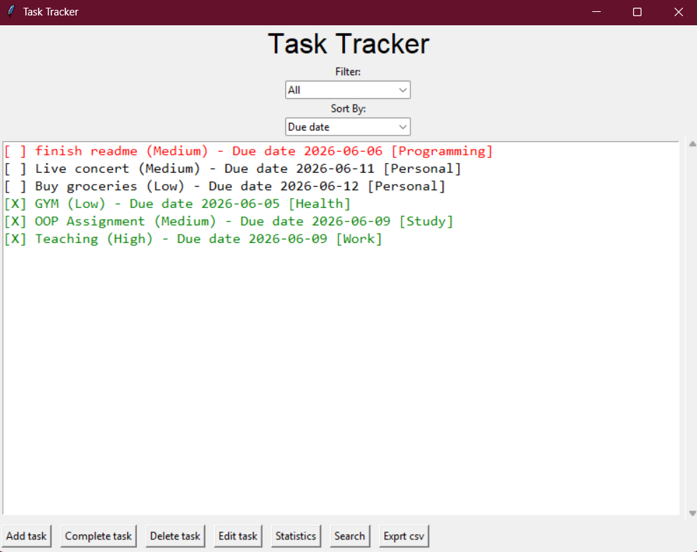
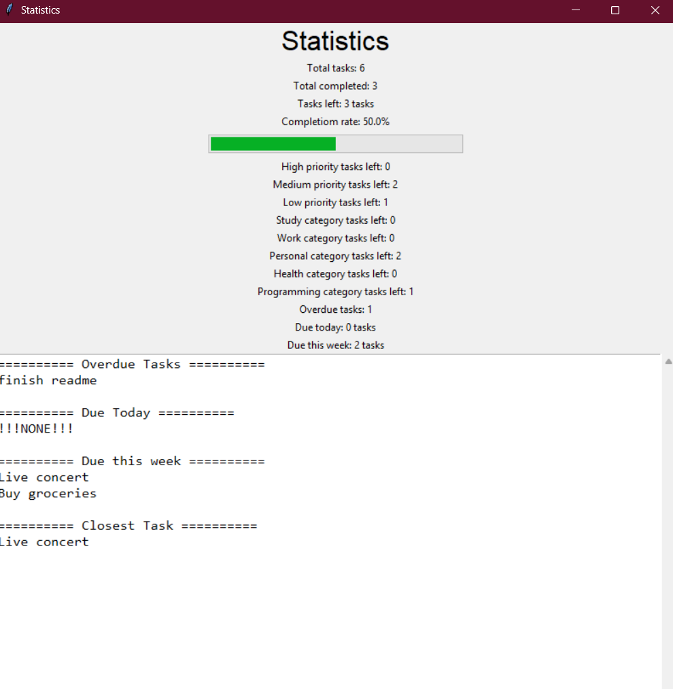
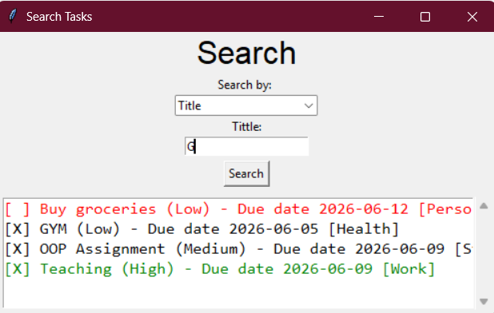
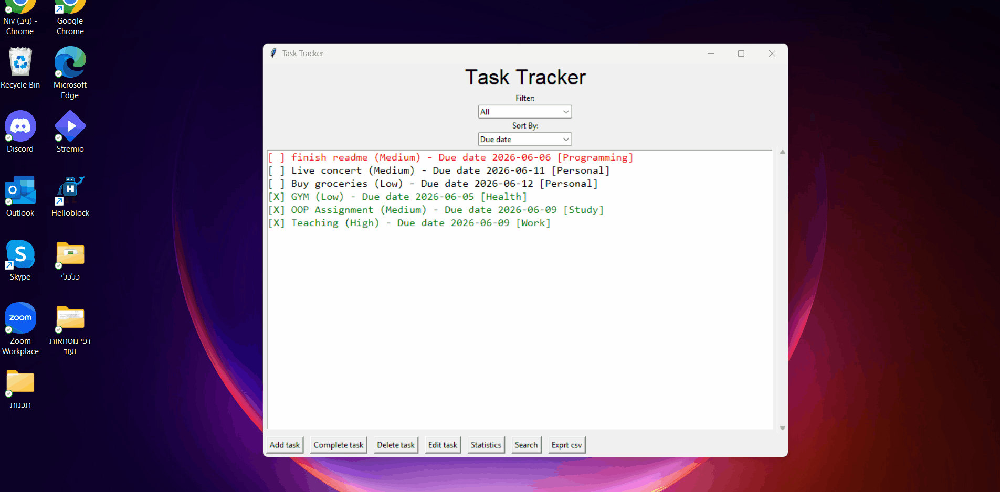

# Personal Task Tracker 

A desktop task management application built with Python and Tkinter.

The application helps users organize tasks, track deadlines, monitor progress, and manage priorities through a graphical user interface.
**Status:** Completed personal project for learning Python, GUI development, data persistence, and software design principles.
---

## Features

### Task Management

* Add new tasks
* Edit existing tasks
* Delete tasks
* Mark tasks as completed

### Organization

* Priority levels (High / Medium / Low)
* Categories:

  * Study
  * Work
  * Personal
  * Health
  * Programming

### Search & Filtering

* Search by title
* Search by priority
* Search by date range
* Filter tasks
* Sort tasks by:

  * Due date
  * Priority
  * Title
  * Category

### Statistics

* Completion rate
* Tasks completed
* Tasks remaining
* Priority statistics
* Category statistics
* Overdue tasks
* Due today
* Due this week
* Closest upcoming task

### Additional Features

* Automatic JSON save/load
* CSV export
* Overdue task notifications
* Color-coded task display

---

## Technologies

* Python
* Tkinter
* ttk
* JSON
* CSV
* Git

---

## Screenshots

### Main Window



### Statistics Window



### Search Window



### Demo


---

## Project Structure

```text
main.py          - Application entry point
gui.py           - Graphical user interface
Task.py          - Task operations
Task_C.py        - Task class definition
Storage.py       - Save and load operations
Validation.py    - Input validation
```

---

## How to Run

```bash
python main.py
```

---

## Future Improvements

* SQLite database support
* Graphical charts
* Dark mode
* Scheduled reminders
* Executable application build
